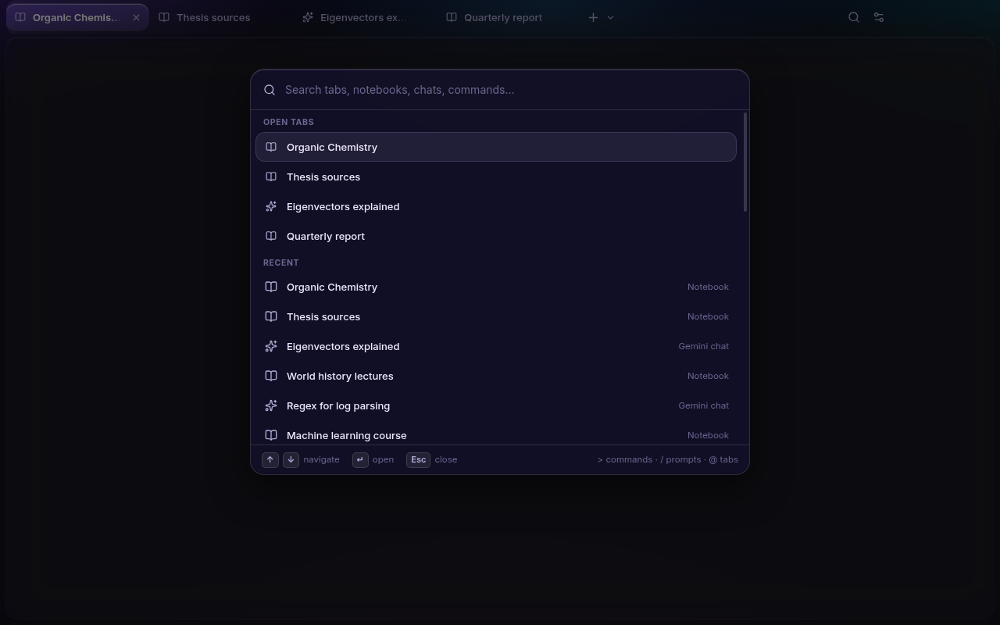
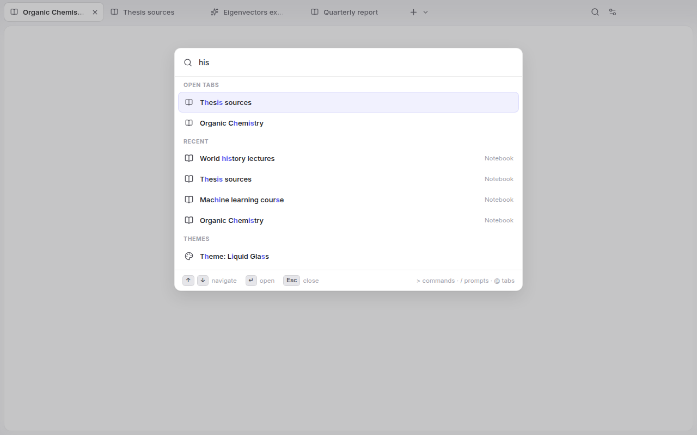
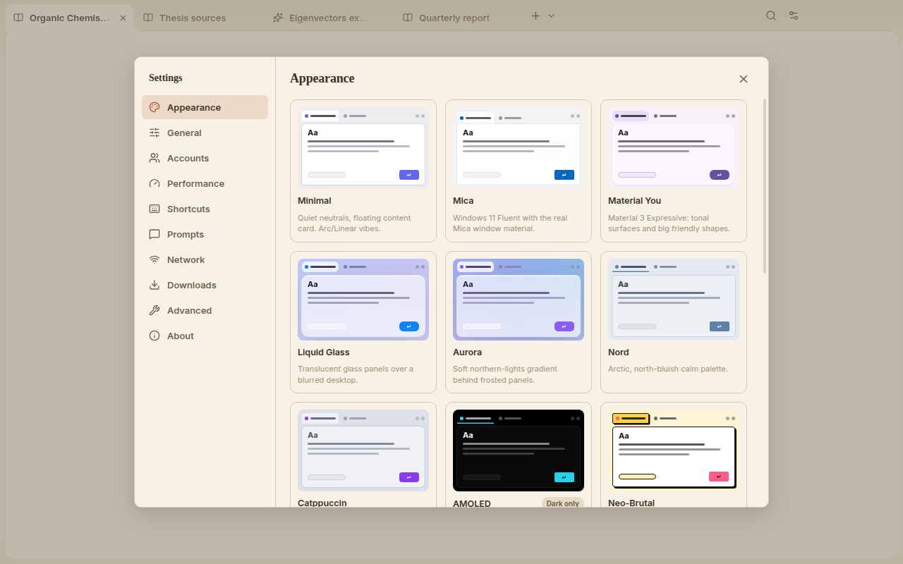
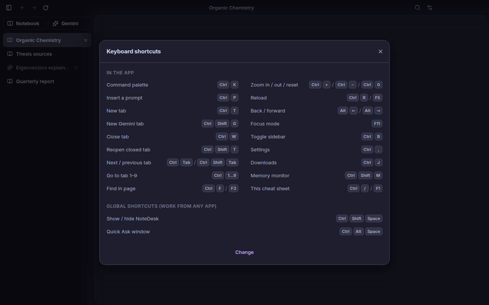

# NoteDesk

*Read in English: [README.md](README.md)*

Десктопное приложение для Gemini Notebook и Gemini — чтобы не жить во вкладке браузера.

[](https://github.com/nikryan-cpu/NoteDesk/releases/latest)
[](https://github.com/nikryan-cpu/NoteDesk/actions/workflows/ci.yml)
[](LICENSE)

> **Неофициальный проект.** NoteDesk никак не связан с Google LLC, не одобрен и не
> спонсируется компанией. «Gemini», «Gemini Notebook» и «NotebookLM» — товарные знаки
> Google LLC. Вход в аккаунт происходит на официальной странице входа Google прямо
> внутри приложения — NoteDesk никогда не видит ваш пароль.

## Скриншоты

| | |
|---|---|
| <br>Общий вид | <br>Командная палитра |
| <br>Темы | <br>Боковая панель, тёмная тема |

## Возможности

### Вкладки и аккаунты
- Вкладки для Gemini Notebook и Gemini в одном окне.
- При запуске сразу загружается только та вкладка, что была активна в прошлый раз —
  остальные подгружаются в момент клика по ним.
- Фоновые вкладки сами уходят в сон — по умолчанию через 10 минут бездействия — и
  полностью освобождают память. Одновременно бодрствуют не больше 4 фоновых вкладок, а
  вкладка, из которой идёт звук, не засыпает никогда. «Разбудить» спящую вкладку — это
  просто перезагрузить её.
- Пока NoteDesk свёрнут в трей, все вкладки могут засыпать по общему таймеру (по
  умолчанию через 30 минут), так что приложение почти не потребляет память, пока им не
  пользуются.
- Несколько Google-аккаунтов одновременно, бок о бок. У каждого — своя изолированная
  сессия входа (отдельные куки, кэш и хранилище), а вкладки каждого аккаунта подсвечены
  своим цветом, чтобы не перепутать.

### Командная палитра и промпты
- `Ctrl+K` открывает командную палитру: открытые вкладки, недавно посещённые ноутбуки и
  чаты, команды и темы оформления — всё в одной строке поиска. Список «недавних» строится
  по собственной истории переходов NoteDesk, а не сканированием страниц Google.
- `Ctrl+P` открывает библиотеку промптов: короткие заготовки, которые вставляются прямо
  в то текстовое поле, где сейчас находится курсор. Есть несколько промптов «из коробки»
  (краткое резюме, объяснить простыми словами, глоссарий терминов, критика и пробелы,
  план изучения) — свои можно добавлять сколько угодно.

### Внешний вид
- 10 тем: Minimal, Mica, Material You, Liquid Glass, Aurora, Nord, Catppuccin, AMOLED,
  Neo-Brutal и Paper — у каждой своя светлая и тёмная палитра (AMOLED — только тёмная).
- Свой акцентный цвет, компактная или комфортная плотность интерфейса, вкладки сверху
  или в боковой панели.
- На Windows 11 темы Mica и Liquid Glass используют настоящий системный материал окна
  (Mica и Acrylic), на macOS — нативный vibrancy. На остальных системах у них свой обычный
  фон.
- Опциональная «плавающая» карточка контента (небольшой отступ и скруглённые углы вокруг
  страницы) и переключатель уменьшения анимаций.

### Трей, горячие клавиши и Quick Ask
- Живёт в системном трее; закрытие окна не обязательно завершает работу приложения.
- Глобальные горячие клавиши (можно переназначить) работают из любого приложения:
  `Ctrl+Shift+Space` показывает или прячет NoteDesk, `Ctrl+Alt+Space` открывает
  **Quick Ask** — компактное окно поверх всех окон для быстрого вопроса без переключения
  на основное окно. Его можно закрепить поверх остальных окон, а само оно закрывается
  (освобождая память) через несколько минут простоя.

### Загрузки и уведомления
- Нативная панель загрузок (`Ctrl+J`): пауза, продолжение, отмена, открытие файла или
  папки с ним, с уведомлением по завершении загрузки в фоне.
- Экспериментальное уведомление «результат в Studio готов» — для Audio и Video Overview
  и других материалов Studio, которые досчитались, пока NoteDesk был свёрнут.

### Сеть
- Прокси на уровне приложения: системные настройки, без прокси или свой HTTP/SOCKS5 —
  независимо от общесистемного сетевого подключения.
- Режим «только Google» отправляет через прокси лишь домены Google (и несколько
  связанных с ними, например YouTube — он участвует во входе в аккаунт), всё остальное
  идёт напрямую.

### Просмотр и окно
- Режим фокусировки (`F11`) убирает всё, кроме страницы.
- Поиск по странице, масштаб для каждого сайта отдельно, проверка орфографии (русский и
  английский, языки настраиваются).
- Ссылки `notedesk://` для перехода в приложение из других программ и скриптов:
  `notedesk://open?url=…` открывает конкретный адрес Google, `notedesk://new/gemini`
  (или `/notebook`) — новую вкладку, `notedesk://quick` — Quick Ask.
- Индикатор отсутствия сети и монитор памяти, который показывает, на что именно уходит
  память, и позволяет тут же усыпить вкладки.

### Вход и обновления
- Настройка совместимости входа на случай, если страница Google не узнаёт приложение
  (подробнее ниже).
- Автообновление с GitHub Releases на Windows и в Linux AppImage; про macOS и `.deb` —
  в разделе [про установку](#про-установку).
- Интерфейс на английском и русском, язык определяется автоматически по системному.

## Горячие клавиши

На macOS везде, где указано `Ctrl`, используйте `Cmd`.

| Действие | Сочетание |
|---|---|
| Командная палитра | `Ctrl+K` |
| Вставить промпт | `Ctrl+P` |
| Новая вкладка | `Ctrl+T` |
| Новая вкладка Gemini | `Ctrl+Shift+G` |
| Закрыть вкладку | `Ctrl+W` |
| Вернуть закрытую вкладку | `Ctrl+Shift+T` |
| Следующая / предыдущая вкладка | `Ctrl+Tab` / `Ctrl+Shift+Tab` |
| Перейти к вкладке 1–9 | `Ctrl+1` … `Ctrl+9` |
| Поиск по странице | `Ctrl+F` или `F3` |
| Масштаб +/-/сброс | `Ctrl+=` / `Ctrl+-` / `Ctrl+0` |
| Перезагрузить | `Ctrl+R` или `F5` |
| Назад / вперёд | `Alt+←` / `Alt+→` |
| Режим фокусировки | `F11` |
| Показать/скрыть боковую панель | `Ctrl+B` |
| Настройки | `Ctrl+,` |
| Загрузки | `Ctrl+J` |
| Монитор памяти | `Ctrl+Shift+M` |
| Эта шпаргалка | `Ctrl+/` или `F1` |

Глобальные горячие клавиши (работают, даже если NoteDesk не в фокусе; меняются в
настройках):

| Действие | По умолчанию |
|---|---|
| Показать / скрыть NoteDesk | `Ctrl+Shift+Space` |
| Quick Ask | `Ctrl+Alt+Space` |

## Загрузка

Последняя версия — на [странице релизов](https://github.com/nikryan-cpu/NoteDesk/releases/latest).

| Платформа | Файл |
|---|---|
| Windows — установщик | `NoteDesk-<version>-Setup.exe` |
| Windows — портативная версия | `NoteDesk-<version>-Portable.exe` |
| macOS — универсальный | `NoteDesk-<version>-universal.dmg` |
| Linux — AppImage | `NoteDesk-<version>-x86_64.AppImage` |
| Linux — Debian/Ubuntu | `notedesk_<version>_amd64.deb` |

### Про установку

**Windows.** Сборки не подписаны сертификатом, поэтому при первом запуске установщика
Windows SmartScreen покажет предупреждение. Нажмите **«Подробнее» → «Выполнить в любом
случае»**.

**macOS.** Сборки также не нотаризованы. После переноса NoteDesk в Applications
выполните:

```sh
xattr -cr /Applications/NoteDesk.app
```

Это снимает карантинный флаг, который macOS ставит на всё, что скачано не из App Store;
без этого Gatekeeper просто откажется открывать ненотаризованное приложение. Делать это
нужно один раз на каждую установку.

**Linux — AppImage.** Сначала сделайте файл исполняемым:

```sh
chmod +x NoteDesk-*.AppImage
```

**Какой файл брать для Windows?** Установщик ставит NoteDesk в папку пользователя и
создаёт ярлыки на рабочем столе и в меню «Пуск». Portable-версия — один `.exe`, который
можно просто положить на рабочий стол или флешку; при каждом запуске он распаковывается,
поэтому стартует чуть медленнее.

**Автообновление.** Установленная версия под Windows и Linux AppImage обновляются сами
в фоне. Portable-версия, сборка для macOS и пакет `.deb` так не умеют (portable никуда не
установлен, на macOS нет подписи, а `.deb` должен обновляться через пакетный менеджер) —
вместо этого NoteDesk покажет ссылку на новый релиз, когда он выйдет.

## Не получается войти в Google?

Иногда Google отказывается пускать во «встроенный браузер», который не узнаёт, и
показывает что-то вроде *«Этот браузер или приложение может быть небезопасным»*.
NoteDesk старается не давать поводов для такой проверки и последовательно представляется
Google обычным Chrome для десктопа — подгоняя под настоящую версию Chromium, на которой
он работает, и строку user-agent, и заголовки с подсказками о браузере, и то, что видно
из JavaScript на странице. Но проверки Google со временем меняются, и иногда всё равно
срабатывают.

Если вход не проходит:

1. Откройте **Настройки → Дополнительно → Совместимость входа** и попробуйте режимы по
   порядку: **Chrome** (по умолчанию) → **Firefox** → **Честно (без маскировки)**.
   После каждой смены перезапускайте NoteDesk.
2. Подождите минуту перед повторной попыткой — Google иногда временно ограничивает
   частые попытки входа.
3. Если это аккаунт **Workspace**, вход из таких приложений может быть ограничен
   администратором организации — тут NoteDesk ничего не может сделать.
4. Не помогло? [Создайте issue](https://github.com/nikryan-cpu/NoteDesk/issues/new?template=sign_in.yml)
   по шаблону про вход — там как раз спрашивают детали, которые реально помогают
   разобраться.

## Прокси

NoteDesk умеет пускать свой трафик через прокси независимо от общесистемных сетевых
настроек — удобно, например, для локального прокси-клиента на `127.0.0.1`. Пара важных
моментов:

- Прокси сам по себе ничего не обходит и не гарантирует доступ к сервисам Google — это
  уже вопрос между вами и Google.
- Chromium (на котором построен NoteDesk) не поддерживает логин и пароль для SOCKS5.
  Если прокси требует авторизацию, используйте HTTP-прокси.
- Режим «только Google» отправляет через прокси лишь домены Google, всё остальное —
  проверка обновлений, внешние ссылки — идёт напрямую.

## Память

Основную часть памяти занимает не сам NoteDesk, а веб-приложения Google в активных
вкладках. Спящая вкладка не занимает памяти вообще.

Мои замеры NoteDesk 1.0.0 на Linux (Xvfb с программным рендерингом, из-за которого
GPU-процесс больше, чем на настоящей видеокарте), в PSS, то есть общая память
учитывается один раз:

| | Память |
|---|---|
| Всё приложение, окно открыто, все вкладки спят | около 310 МБ |
| …из них собственный интерфейс приложения | около 60 МБ |
| Активная вкладка с пустой страницей | ещё около 40 МБ |

Страницы Gemini Notebook и Gemini занимают заметно больше пустой страницы, и сколько
именно — зависит от ноутбука или чата. Панель памяти (`Ctrl+Shift+M`) показывает точные
цифры по каждой вкладке на вашем компьютере; в Windows она считает приватную память,
поэтому числа там не совпадут с таблицей один в один.

## Приватность

- Никакой телеметрии и аналитики — приложение никуда не отчитывается о том, как вы им
  пользуетесь.
- Все данные остаются на вашем компьютере, в локальной папке профиля NoteDesk. Куки
  шифруются ключом, который хранит сама ОС (DPAPI в Windows, Keychain в macOS, secret
  service в Linux); пароль прокси, если он задан, — тоже.
- Сетевые запросы уходят только к Google (те страницы, что вы сами открываете) и к
  GitHub — чтобы проверить наличие новых версий.

## Сборка из исходников

Нужен Node 22 или новее (рекомендуется 24-я версия).

```sh
npm install
npm run dev          # запуск в режиме разработки
npm run typecheck    # проверка типов TypeScript и Svelte
npm test             # модульные тесты (vitest)
npm run test:e2e     # сквозные тесты (Playwright; на Linux — через xvfb-run)
npm run dist:win     # сборка под Windows
npm run dist:mac     # сборка под macOS
npm run dist:linux   # сборка под Linux
npm run icons        # пересобрать иконки из исходных SVG
```

Если запускать `npm run dev` прямо из VS Code (или другого редактора на Electron),
`scripts/run.mjs` убирает переменную окружения `ELECTRON_RUN_AS_NODE`, которую такие
редакторы выставляют для своих дочерних процессов — без этого Electron запустился бы
как обычный Node и сразу завершился, вместо того чтобы открыть окно.

## В планах

Зависит от того, насколько стабильной Google оставит вёрстку соответствующих страниц;
скорее всего появится сначала за флагом:

- Раздельный вид (две вкладки бок о бок)
- Экспорт чата в Markdown
- Конвертация WAV → MP3 для скачанных Audio Overview
- Пункт «Отправить в NoteDesk» в контекстном меню проводника Windows
- Массовый импорт по списку ссылок
- Папки для вкладок

## Лицензия

[MIT](LICENSE)
